# Financial Sentiment Analysis 

Classify the sentiment (**positive**, **negative**, or **neutral**) of short financial statements and news sentences using classic machine learning models and a deep learning (Bi-LSTM + CNN) model.

## Overview

This project explores sentiment classification on financial text data. It covers the full pipeline — exploratory data analysis, text cleaning, feature engineering, and model benchmarking — comparing 10 traditional ML classifiers against a hybrid deep learning architecture.

## Dataset

- **File:** `Data.csv` (financial sentences labeled with sentiment)
- **Columns:** `Sentence` (raw financial text) and `Sentiment` (`positive` / `negative` / `neutral`)
- Duplicate rows are removed during preprocessing.

### Sentiment Class Distribution

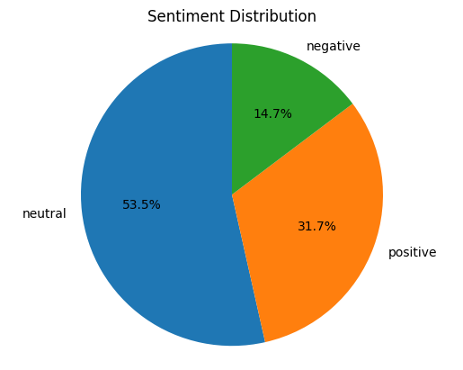

## Project Workflow

### 1. Exploratory Data Analysis
- Checked for nulls and duplicates
- Visualized sentiment class distribution (pie chart above)

### 2. Text Preprocessing
- Lowercasing
- Removing URLs, mentions, hashtags, punctuation, and numbers
- Tokenization (NLTK)
- Stopword removal and lemmatization (`WordNetLemmatizer`)
- Word-count distribution analysis

<p float="left">
  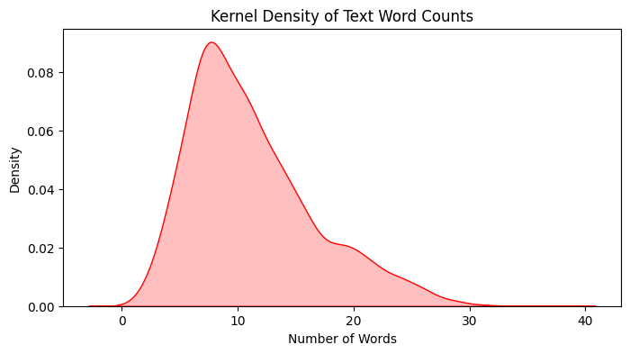
  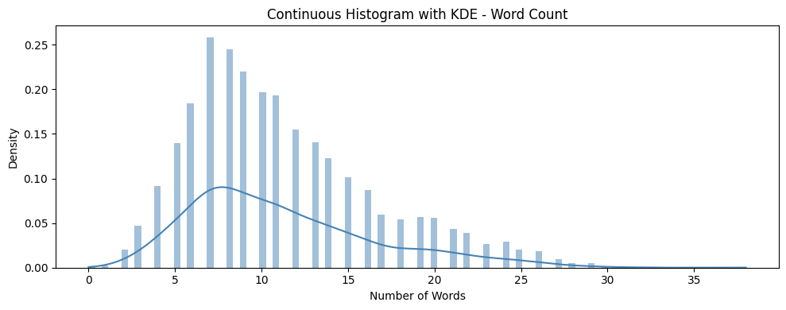
</p>
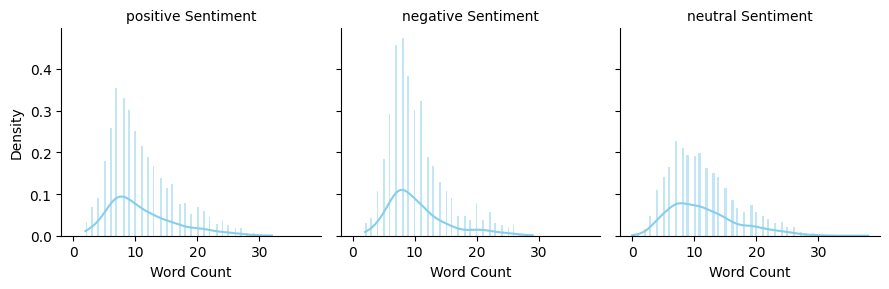

### 3. Feature Engineering
- TF-IDF vectorization (`max_features=5000`, unigrams + bigrams)
- Dimensionality reduction with PCA for visualization
- Label encoding of sentiment classes

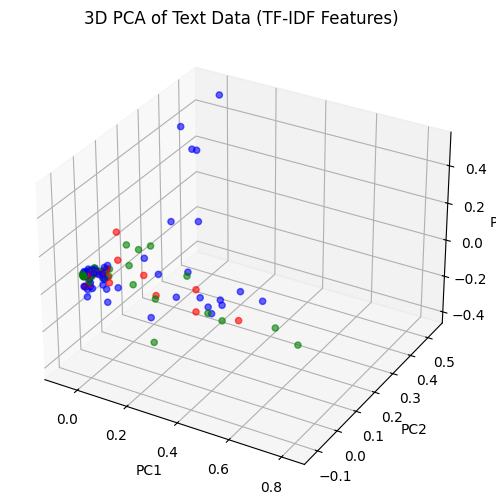

*3D PCA projection of TF-IDF features, colored by sentiment class.*

### 4. Model Training — Classical ML

Ten classifiers were trained and benchmarked on the TF-IDF features:
Random Forest, Gaussian/Multinomial/Complement Naive Bayes, Logistic Regression, Linear SVC, Gradient Boosting, AdaBoost, XGBoost, and LightGBM.

Each model's ROC curve (one-vs-rest, per class) and confusion matrix were generated — see [Attention Outputs](#attention-outputs--per-model-diagnostics) below.

### 5. Model Training — Deep Learning
- Tokenization and padding of sequences (Keras `Tokenizer`, `pad_sequences`)
- Custom hybrid architecture:
  - Embedding layer
  - Bidirectional LSTM
  - 1D Convolution
  - Global Average + Max Pooling (concatenated)
  - Batch Normalization, Dropout, Dense layers
- Trained with early stopping and model checkpointing

### 6. Evaluation
- Accuracy, precision, recall, and F1-score for every model
- Bar chart comparison across all classical models
- Test accuracy/loss reported for the deep learning model

## Results

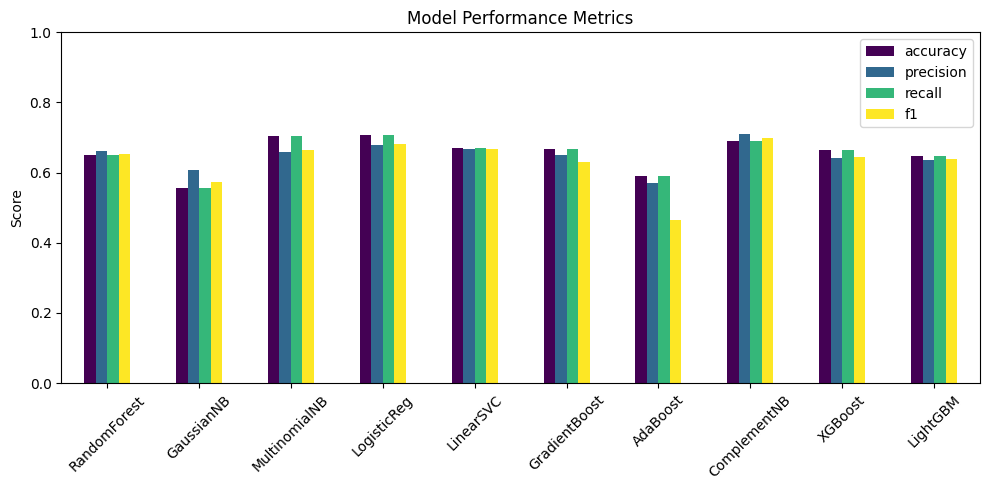

| Model | Accuracy | Precision | Recall | F1-score |
|---|---|---|---|---|
| **Logistic Regression** | **0.7063** | 0.6799 | 0.7063 | 0.6818 |
| Multinomial NB | 0.7046 | 0.6597 | 0.7046 | 0.6655 |
| Complement NB | 0.6901 | 0.7097 | 0.6901 | 0.6980 |
| Linear SVC | 0.6712 | 0.6663 | 0.6712 | 0.6685 |
| Gradient Boosting | 0.6678 | 0.6499 | 0.6678 | 0.6292 |
| XGBoost | 0.6644 | 0.6417 | 0.6644 | 0.6444 |
| Random Forest | 0.6515 | 0.6609 | 0.6515 | 0.6541 |
| LightGBM | 0.6473 | 0.6348 | 0.6473 | 0.6386 |
| AdaBoost | 0.5916 | 0.5700 | 0.5916 | 0.4648 |
| Gaussian NB | 0.5565 | 0.6075 | 0.5565 | 0.5740 |

**Bi-LSTM + CNN (deep learning):** Test Accuracy = **0.6430**, Test Loss = 0.9368

Logistic Regression on TF-IDF features achieved the best overall performance among all models tested — outperforming both the ensemble methods and the deep learning model on this dataset size.

## Attention Outputs — Per-Model Diagnostics

ROC curves (one-vs-rest per sentiment class) and confusion matrices for each classical model:

<details>
<summary><b>Random Forest</b></summary>
<p float="left">
  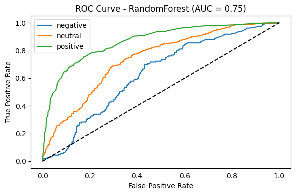
  
</p>
</details>

<details>
<summary><b>Logistic Regression (best model)</b></summary>
<p float="left">
  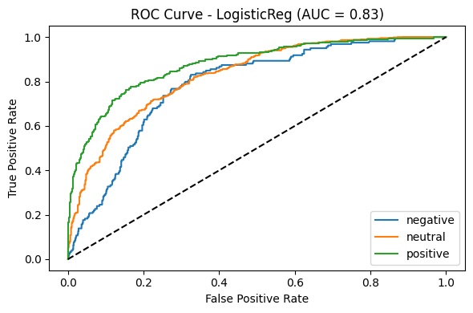
  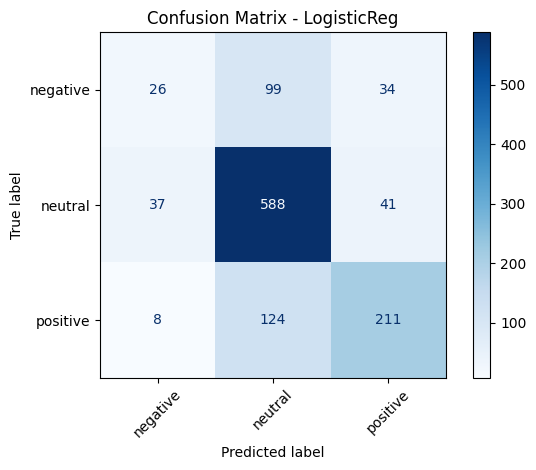
</p>
</details>

<details>
<summary><b>Multinomial Naive Bayes</b></summary>
<p float="left">
  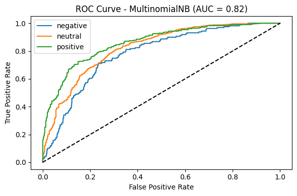
  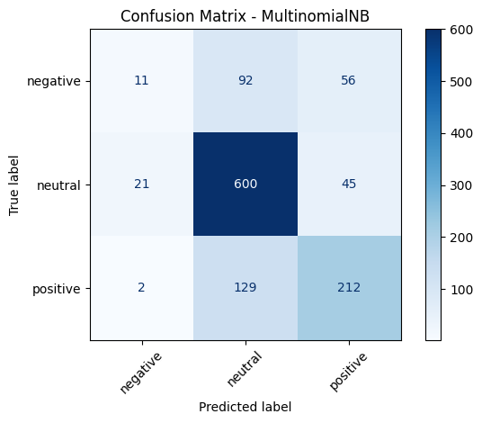
</p>
</details>

<details>
<summary><b>Complement Naive Bayes</b></summary>
<p float="left">
  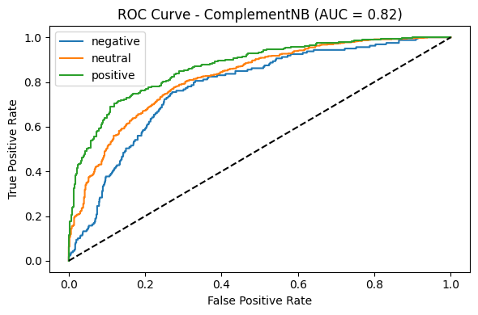
  
</p>
</details>

<details>
<summary><b>Gaussian Naive Bayes</b></summary>
<p float="left">
  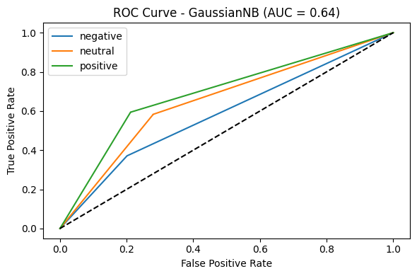
  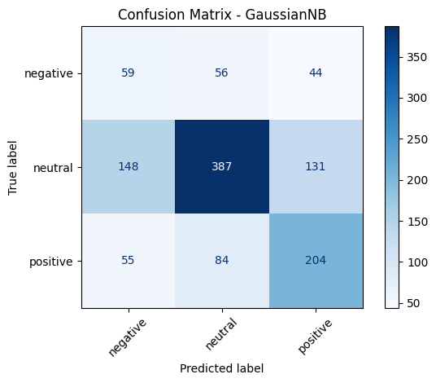
</p>
</details>

<details>
<summary><b>Linear SVC</b> (no probability output → confusion matrix only)</summary>
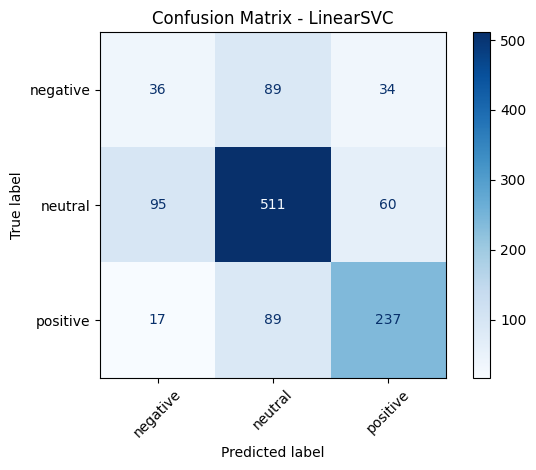
</details>

<details>
<summary><b>Gradient Boosting</b></summary>
<p float="left">
  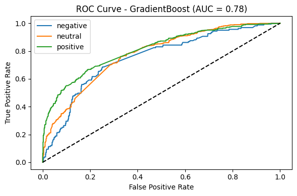
  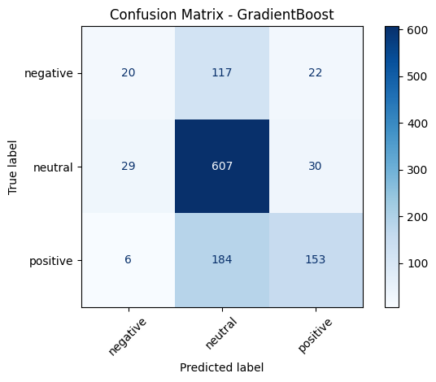
</p>
</details>

<details>
<summary><b>AdaBoost</b></summary>
<p float="left">
  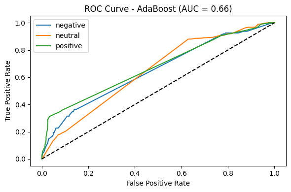
  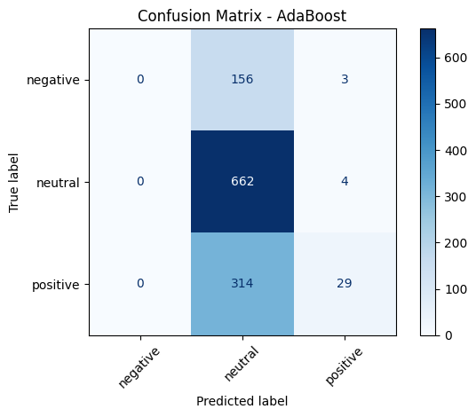
</p>
</details>

<details>
<summary><b>XGBoost</b></summary>
<p float="left">
  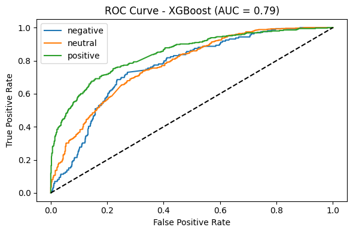
  
</p>
</details>

<details>
<summary><b>LightGBM</b></summary>
<p float="left">
  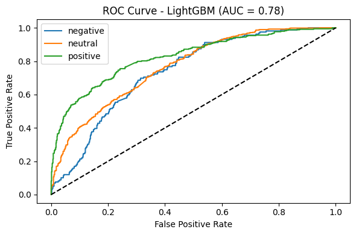
  
</p>
</details>

## Repository Structure

```
Financial-Sentiment-Analysis/
├── Financial_Sentiment_Analysis.ipynb    # Main notebook (EDA → preprocessing → modeling)
├── graphs/                               # All exported plots referenced in this README
│   ├── sentiment_distribution_pie.png
│   ├── word_count_kde.png
│   ├── word_count_histogram_kde.png
│   ├── word_count_by_sentiment_facet.png
│   ├── pca_3d_tfidf.png
│   ├── model_performance_barplot.png
│   ├── <Model>_roc_curve.png
│   └── <Model>_confusion_matrix.png
├── Data.csv                              # Dataset (add your own copy — not tracked here)
└── README.md
```

## Requirements

- Python 3.x
- pandas, numpy, matplotlib, seaborn
- nltk, spacy
- scikit-learn
- lightgbm, xgboost
- tensorflow / keras

Install the core dependencies with:

```bash
pip install pandas numpy matplotlib seaborn nltk spacy scikit-learn lightgbm xgboost tensorflow
```

On first run, download the required NLTK resources:

```python
import nltk
nltk.download('stopwords')
nltk.download('punkt')
nltk.download('wordnet')
```

## Getting Started

1. Clone the repository:
   ```bash
   git clone https://github.com/Mahith2203/Financial-Sentiment-Analysis.git
   cd Financial-Sentiment-Analysis
   ```
2. Install the dependencies (see above).
3. Open `Financial_Sentiment_Analysis.ipynb` in Jupyter Notebook / JupyterLab.
4. Run the cells sequentially — from data loading through model evaluation.

## Future Improvements

- Use pretrained word embeddings (GloVe/Word2Vec) instead of random embedding initialization
- Fine-tune a transformer-based model (e.g., FinBERT) for domain-specific performance
- Address class imbalance with resampling or class-weighted loss
- Hyperparameter tuning across all classical and deep learning models

## License

No license specified yet — consider adding one (e.g., MIT) if you plan to open this project up for contributions.
